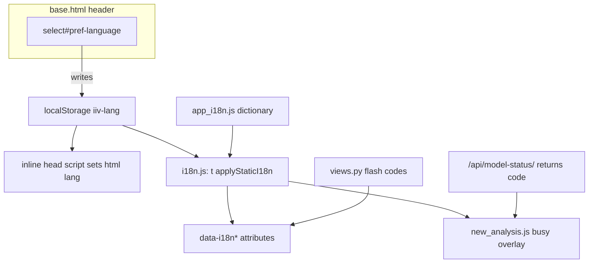

# Dual-language UI (EN + pt-PT)

## Context

Small Django app: 5 templates, inline JS only, **no static files yet**, **no i18n**. All user-facing copy lives in templates, [`forms.py`](image_is_versatile/forms.py), [`views.py`](image_is_versatile/views.py) flash messages, and [`model_availability.py`](image_is_versatile/services/model_availability.py) / provider adapters.

Reference pattern: [`docs/i18n-pattern.md`](docs/i18n-pattern.md) (CentCompras). We adapt it for this project:

- **Storage:** `iiv-lang` (`en` | `pt`), event `iiv-lang-changed`
- **No Django gettext / `.po` files** — browser owns visible UI copy
- **No server-side user locale** — per-browser `localStorage`
- **Greenfield:** refactor APIs to return stable `code` keys from day one; English remains fallback in HTML and logs



## What gets translated

| Area | Approach |
|------|----------|
| Nav, headings, buttons, help text, table headers | `data-i18n` / `data-i18n-placeholder` / `data-i18n-aria` in templates |
| Form labels & help (currently `{{ form.*.label }}`) | Replace with explicit elements keyed in dictionary (forms keep validation logic only) |
| Flash messages (`messages.success/error`) | Store **message codes** in views; template renders English fallback + `data-i18n` |
| Form validation errors | `ValidationError` with stable codes (`unknown_vision_model`, `additional_required_when_omit`, …) |
| Model-status API + inline JS on new page | JSON `{ ok, code, message, ...vars }`; client uses `apiErrorMessage()` |
| Status badges (`In progress`, `Completed`, `Error`) | `data-i18n="statusInProgress"` etc. keyed by `analysis.status` |
| Prompt preset **labels** (dropdown) | `data-i18n="preset_{id}"` on `<option>` elements |
| Dates in history/detail | `data-datetime` ISO attribute + `Intl.DateTimeFormat` on load / lang change |
| Busy overlay (“Working…”, “Analyzing image…”) | Dictionary keys; `data-wait` becomes `data-wait-i18n` key |

**Not translated** (by design): model/provider product names, preset **instruction text** sent to APIs, analysis responses, provider error payloads stored in DB, JSON debug blocks.

## New static assets

Create [`image_is_versatile/static/image_is_versatile/js/`](image_is_versatile/static/image_is_versatile/js/):

| File | Role |
|------|------|
| `app_i18n.js` | Single dictionary: `{ en: {...}, "pt-PT": {...} }` + `APP_I18N.pt = APP_I18N["pt-PT"]` (~80–100 keys) |
| `i18n.js` | `safeGet`, `currentLang()`, `t(key, vars)`, `applyStaticI18n()`, `apiErrorMessage()`, `formatDateTime()`, `applyPresetOptionLabels()` |
| `preferences.js` | Header `<select id="pref-language">`; read/write `iiv-lang`; dispatch `iiv-lang-changed` |
| `new_analysis.js` | Extract model-status fetch from [`new.html`](image_is_versatile/templates/image_is_versatile/new.html); translate via `code` |
| `busy.js` | Extract busy-overlay logic from [`base.html`](image_is_versatile/templates/image_is_versatile/base.html); resolve `data-wait-i18n` |

Wire in [`base.html`](image_is_versatile/templates/image_is_versatile/base.html) with `` and cache-buster `?v=1`.

## Template changes

### [`base.html`](image_is_versatile/templates/image_is_versatile/base.html)

1. **Early `<head>` script** — read `iiv-lang` (and optionally skip theme; no dark mode today) before paint; set `document.documentElement.lang` to `en` or `pt-PT`.
2. **Language selector** in header nav (EN / Português).
3. Mark up chrome: app title, tagline, nav links, busy message, `aria-label`.
4. Flash messages:

```html
<li class="{{ message.tags }}" data-i18n="{{ message.message }}">{{ message.message }}</li>
```

(Views will pass codes like `analysis_completed`; dictionary holds human text.)

5. Load shared scripts at end of body.

### Child templates

- [`history.html`](image_is_versatile/templates/image_is_versatile/history.html) — table headers, empty state, buttons, status badges, datetime cells
- [`new.html`](image_is_versatile/templates/image_is_versatile/new.html) — form labels/help, buttons, status panel; `data-wait-i18n="analyzingImage"` on form
- [`detail.html`](image_is_versatile/templates/image_is_versatile/detail.html) — meta labels, section headings, details summaries
- [`settings.html`](image_is_versatile/templates/image_is_versatile/settings.html) — all static copy + factory-default labels

## Server refactor (greenfield-friendly)

### Stable error codes

Extend [`ModelAvailabilityStatus`](image_is_versatile/services/providers/base.py) with optional `code: str` and `vars: dict`. Update:

- [`model_availability.py`](image_is_versatile/services/model_availability.py)
- [`openai_responses.py`](image_is_versatile/services/providers/openai_responses.py), [`gemini.py`](image_is_versatile/services/providers/gemini.py)
- [`base.py`](image_is_versatile/services/providers/base.py) `map_provider_error` → return `(code, vars)` mapping

Example codes:

| Code | Vars |
|------|------|
| `api_key_missing` | `env_key` |
| `model_available` | `model`, `provider` |
| `model_not_on_account` | `api_model`, `provider` |
| `unknown_model` | `model_id` |
| `provider_auth_rejected` | `env_key`, `provider` |
| `provider_rate_limited` | `provider` |
| `provider_unreachable` | `provider` |
| `provider_unexpected_error` | `provider`, `detail` |

[`ModelStatusView`](image_is_versatile/views.py) JSON keeps `message` (EN fallback for tests/logs) **and** adds `code` + interpolation fields.

### Views flash messages

Replace literal strings with codes:

```python
messages.success(request, "analysis_completed")
messages.error(request, "analysis_failed")  # + optional context via message extra_tags if needed
```

For `analysis_failed` with `{detail}`, use a small helper or `messages.error(request, "analysis_failed", extra_tags=detail)` and a dedicated `data-i18n-vars` attribute — keep this minimal (one pattern only).

### Forms

[`forms.py`](image_is_versatile/forms.py): strip English `label`/`help_text` (or leave as unused fallback); raise `ValidationError("unknown_vision_model")` etc. [`prompt_presets.py`](image_is_versatile/prompt_presets.py): `ComposeEvalTextError` carries codes (`additional_required_when_omit`, `invalid_preset`).

### Settings tweak

[`config/settings/base.py`](config/settings/base.py): set `LANGUAGE_CODE = "en-gb"` to align with pattern doc (cosmetic; server locale unused for UI).

## Dictionary structure (representative keys)

```javascript
const APP_I18N = {
  en: {
    appTitle: "Image Analysis",
    navHistory: "History",
    navNew: "New analysis",
    navSettings: "Settings",
    langLabel: "Language",
    statusInProgress: "In progress",
    analysis_completed: "Analysis completed.",
    api_key_missing: "{env_key} is not set.",
    // …all template + form + API codes
  },
  "pt-PT": { /* Portuguese */ },
};
APP_I18N.pt = APP_I18N["pt-PT"];
```

## Tests

Update [`test_views.py`](image_is_versatile/tests/test_views.py) and [`test_model_availability.py`](image_is_versatile/tests/test_model_availability.py):

- HTML assertions still pass (English fallback text remains in templates)
- Model-status tests assert `code` field (e.g. `api_key_missing`) alongside EN `message`
- Run: `.venv/bin/python manage.py test image_is_versatile.tests`
- Run: `node --check` on new JS files

## Docs

Rewrite [`docs/i18n-pattern.md`](docs/i18n-pattern.md) from CentCompras reference into **this project's** authoritative doc: actual paths, `iiv-lang` keys, file list, checklist.

## Out of scope

- Dark theme (`iiv-theme`) — CSS vars exist but no toggle requested
- `docs/user-manuals/` — not part of this app
- Translating AI prompt bodies or stored analysis content
- DB schema changes (status values stay English slugs; display is client-side)

## Verification checklist

1. Open `/` — default English; switch to Português — nav, table, badges update without reload
2. Navigate to `/new/` — language persists; model-status messages translate
3. Submit analysis — flash message on detail page is translated
4. `/settings/` — labels, help, buttons in both languages
5. `html[lang="pt-PT"]` set when Portuguese active; dates use `pt-PT` locale formatting
